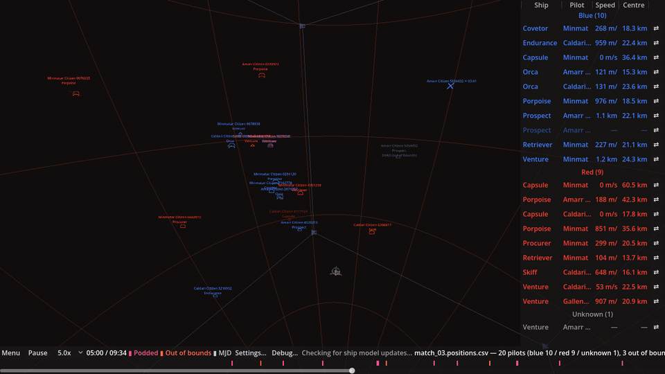
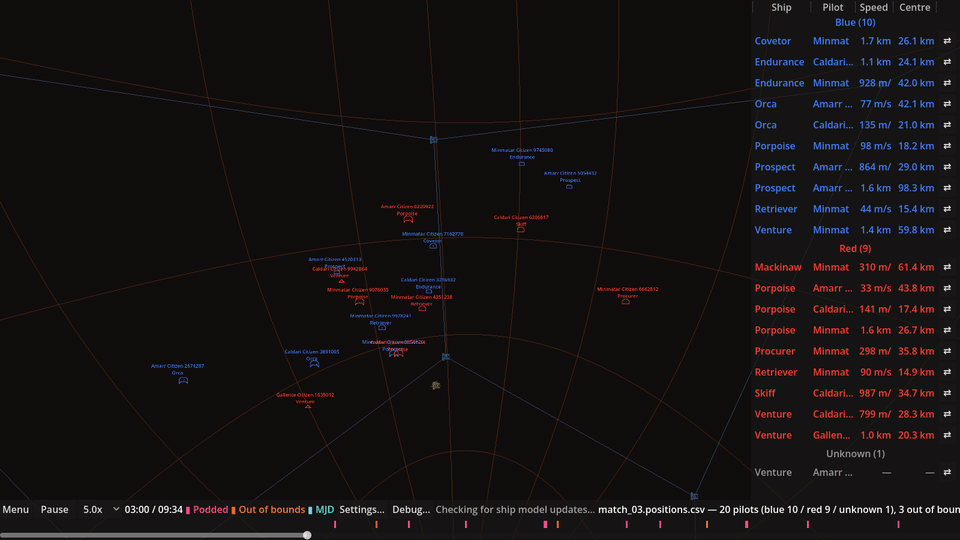
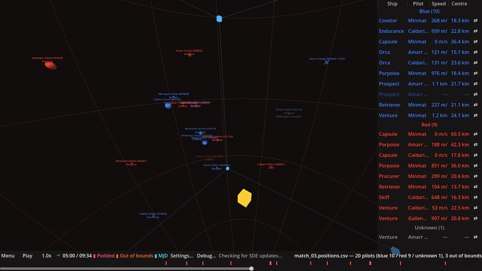

# Scrim Simulator

**[Download the latest release](https://github.com/AckbadP/ScrimSimulator/releases/latest)**
(Linux and Windows).

Scrim Simulator turns a recording of an EVE Online scrim into a 3D replay you can scrub through,
pause, and inspect from any angle.



1. **Record.** Three stationary observer clients sit on grid while OBS records their overviews
   into one video.
2. **Process.** `scrim-positions` reads (OCRs) each observer's overview in every frame and works
   out every ship's position from the three distances it sees, writing a `*.positions.csv`.
3. **Watch.** The simulator replays that CSV in 3D: hull models, team colours, kills, micro jumps,
   range spheres, a measuring tool, and optional match audio.

Nothing reads EVE client memory and nothing automates or injects input. The pipeline only uses
what the client draws on screen for the player. See [`docs/DESIGN.md`](docs/DESIGN.md) for the
full design and the maths.

## What's in the downloads

Each release has two zips per platform. You only need the first to watch matches.

**`scrim-simulator-…zip`**, the replay viewer:

| File | What it is |
|---|---|
| `scrim-simulator` (`.x86_64` / `.exe`) | The replay viewer. |
| `glb-undraco` | Helper the simulator runs to unpack downloaded ship models. Keep it next to the simulator. |
| `demo/` | The demo match and a combat log for it, added to the match list on first run. |

**`scrim-positions-…zip`**, for processing your own recordings:

| File | What it is |
|---|---|
| `scrim-positions` (`.exe`) | Turns a recorded match video into a `*.positions.csv`. Needs `ffmpeg` and `ffprobe` on your `PATH`. |
| `scrim-positions-gui` (`.exe`) | A window for running `scrim-positions` without the command line. Keep it next to `scrim-positions`. |
| `scene.json` | Where each observer's overview is in a video recorded with the [OBS template](docs/obs/README.md). |

## Quick start: watch the demo match

1. Unzip the simulator download and run `scrim-simulator`.
2. On first run it asks to download ship data: sizes from CCP's Static Data Export, bracket icons
   from CCP's Image Export Collection, and hull models from
   [EVE_Model_Gallery](https://github.com/EstamelGG/EVE_Model_Gallery). These go into `sde/` next
   to the executable. Models are fetched one hull at a time, the first time a match needs one.
3. **Demo match** is already in the match list. Select it and click **Open** (or double-click it).
   If you remove it, it stays removed; add it back with **Add match…** and the file in `demo/`.
4. Press **Start** (or Space).

## Recording your own match

[`docs/obs/`](docs/obs/README.md) has an OBS scene collection for recording three observer
clients side by side, and explains how to set it up: which windows to capture, how to crop to the
overview, and which video settings to use. Record near-lossless. The OCR needs crisp text.

[`docs/eve/`](docs/eve/README.md) has an EVE client window layout for the observers (2486×1374
windowed, UI scale 1.75) and explains how to copy it onto each observer character. The OBS
template's crops are made for this layout, so if every observer uses it there is nothing to crop.

## Processing a recording

This uses `scrim-positions` from the separate `scrim-positions-…zip` download (or a source build).

```sh
scrim-positions --scene docs/obs/scene.json --out out/ match.mkv
```

This writes `out/match.positions.csv` and the recording's audio as `out/match.mp3` (skip it with
`--no-audio`); the simulator pairs the two by name when the folder is added. `scene.json` tells it where each observer's overview is in
the video frame. The one in `docs/obs/` matches the OBS template; adjust its panel rectangles if
your layout differs.

### Without the command line

`scrim-positions-gui` runs `scrim-positions` from a window: pick the video, the chat log (see
below), the output folder and, optionally, the pilots' gamelogs (**Add logs…**; each is listed
with its character so you can tell them apart), untick **Extract audio** if you
don't want the mp3, and press **Run**. Its output is shown as it works, and your choices are
remembered for next time. It looks for `scrim-positions` and `scene.json` next to itself.

The CSV has one row per pilot per second:
`t,pilot,ship_type,x_m,y_m,z_m,speed_mps,dir_x,dir_y,dir_z,residual_m,shield,armor,hull`.
`shield`, `armor` and `hull` are the pilot's remaining HP (0–1), read off the rings of the locked
targets the OBS template records; they're blank while no observer has the pilot locked. Whose ring
is whose comes from its label, read with Tesseract (on `PATH`, or `--tesseract`).

### One match, with EVE timestamps

Give it the observer's Local chat log as well, and it processes just the match and stamps every
row with its EVE time:

```sh
scrim-positions --scene docs/obs/scene.json --chat-log Local_20260404_174253_123.txt --out out/ match.mkv
```

[ScrimTrimmer](https://github.com/AckbadP/ScrimTrimmer) (a submodule in `third_party/`) reads the
chat window recorded by the OBS template (the scene's `chat` rect), matches it against the log to
find the EVE time at the start of the video, and finds the match in the log: from `CD` (or a bare
`10, 9, 8…` countdown) to `WF`/`GF`. Only that window is OCR'd, and the CSV gains an `eve_time`
column (ISO 8601 UTC, e.g. `2026-04-04T17:43:59.000Z`): the first row is the start of the data, the
last row the end, and every tick in between can be lined up with combat logs and other EVE logs.
The saved `match.mp3` covers the same window, so it starts with the data.

- More than one CD→WF in the video: pick one with `--match N`, or process each with `--match all`
  into its own `match_01.positions.csv`, `match_01.mp3`, `match_01.positions.logs/`, … (the GUI
  does this).
  The observers must stay put for the whole video: which cube corners they sit on is worked out
  once from all its matches, so a match whose start alone can't tell (everyone far from every
  observer) uses the others' evidence. Record observers that move to new corners in separate
  videos.
- `--t0 HH:MM:SS` gives the EVE time at video second 0 yourself, skipping the chat OCR.
- `--tournament` uses the tournament system messages ("30 seconds until match start",
  "Match completed!") instead.
- Without `--chat-log`, `--t0 2026-04-04T17:43:55Z` stamps the whole video with EVE times.
- `--combat-log FILE` (repeatable; a folder such as `Documents/EVE/logs/Gamelogs` works too) saves
  each gamelog with combat during the match, cut down to the match, in
  `out/match.positions.logs/`, where the simulator picks them up when the CSV is added (see
  [combat logs](#match-list)). Logs with no combat in the match, such as the observers', are
  skipped.

This needs a source checkout (it runs `scripts/scrim_trimmer_bridge.py`), Python 3 and Tesseract:

```sh
git submodule update --init            # or clone with --recurse-submodules
sudo apt install tesseract-ocr         # Windows: the UB-Mannheim Tesseract build, on PATH
pip install -r scripts/requirements-trimmer.txt
```

Set `$SCRIM_PYTHON` (or `--python`) to use a different interpreter, e.g. a virtualenv's.

## Using the simulator

### Match list

The main menu lists the matches you have added. **Add match…** adds a `*.positions.csv`, and
dropping a CSV onto the window adds it and opens it straight away. Select a match and use
**Rename…**, **Remove** or **Add audio…** (also on its right-click menu). Audio (ogg, mp3 or wav) should start at the same moment
as the match data; it then plays in sync with the replay, at any playback speed.
`scrim-positions` saves it next to the CSV, or
[ScrimTrimmer](https://github.com/AckbadP/ScrimTrimmer) can extract a match's audio.
**Menu** returns
to the list.

Matches can be sorted into folders, nested as deep as you like. **New folder…** makes one (inside
the selected folder, if any); move a match or folder by dragging it onto another folder (or onto
empty space for the top level), or with **Move to** on its right-click menu. Rename and remove
work on folders too; removing a folder deletes the matches in it.

**Add folder…** (or dropping a folder onto the window) adds a whole scrim at once: every
`*.csv` in the folder becomes a match in a library folder of the same name. Audio files in it are
paired with matches by name — `match_03.positions.csv` with `match_03.mp3` — or, failing that, by
the number the names end in, so `clip_001.positions.csv` pairs with ScrimTrimmer's
`match_001.mp3`. Gamelogs (`*.txt`) in it are tried against every match, each keeping only the
combat during it (see below). Adding the same folder again changes nothing.

Right-click a match → **Add combat logs…** to attach EVE gamelogs
(`Documents/EVE/logs/Gamelogs/*.txt`), one per pilot whose combat you have. Each log is matched to
the pilot whose name is its listener's (allowing for names the overview cut short) and lined up
with the replay by EVE time, so the match's CSV needs an `eve_time` column (see
[One match, with EVE timestamps](#one-match-with-eve-timestamps)). Only the part of a log written
during the match is saved; the rest is discarded, and a log with no combat during the match isn't
added. Logs saved in a `<csv name without .csv>.logs/` folder next to a CSV come along when the
CSV is added, as the demo match's does.

With logs attached, the roster gains combat columns: **Dmg in/out**, **Reps in/out** and **Cap
in/out** (HP or GJ per second over the last 10 s of the replay; cap counts neuts and nosferatus),
and **EWAR in/out**, an icon per kind of electronic warfare on or by the pilot at that moment —
scrams, disruptors, neuts, nosferatus and ECM jams. Each lasts its module's cycle, estimated from
the log (overheating can make it a little off). Hover an icon for who it is from or to and how
many cycles so far. Events seen in several logs are counted once; drones and pilots that can't be
matched to the replay are left out. Columns with no data are hidden, and like the others they can
be moved, resized or hidden from the roster header. EVE gamelogs don't record sensor dampeners,
tracking or guidance disruptors, target painters, or remote sensor boosters and tracking
computers, so those never show. EWAR icons are fetched once from CCP's image server the first
time they're shown and kept in `sde/assets/ewar/` (until then, or offline, they show as text).

When the CSV has `shield`/`armor`/`hull`, the roster's **HP** column and the broadcast panel show
each pilot's remaining shield, armor and hull as bars (grey while no observer has the pilot
locked). **Damage** (bottom bar, or Settings) highlights the rows of ships whose HP is dropping:
a layer lower than its last reading and more than 3% below its best of the previous 3 s, held for
2 s.

A micro jump (a 100 km hop) is taken to spool up for the 12 ticks before it lands. Meanwhile the
broadcast panel shows the MJD module icon beside the ship's speed, and **MJD** (bottom bar, or
Settings) draws the spool-up in space: a ring around the ship filling as it spools, and an arrow to
where it would land if it jumped now — 100 km along its current heading, updated live, not where
it actually lands.

The broadcast panel scores the match under a tournament ruleset (picker in the bottom bar, saved
per match; the newest by default). Each row's **PTS** is its ship's points, inflated by the
hull's per-copy rate when a team fields the same ship more than once. A team's score is the points
of every enemy ship lost (podded or out of bounds), plus whatever the enemy fleet leaves of the
points cap as a head start. Rulesets live in `simulator/rulesets/` and are generated from that
year's comp calculator sheet:

```sh
scripts/ruleset_from_sheet.py <google sheet id> --id ATXXII --name "Alliance Tournament XXII" --order 22
```

Right-click a pilot → **Get Damage Breakdown** opens a window of the damage coming in on that pilot
from each attacker: pilot, ship and DPS (over the last 10 s, like the roster), highest first, with
the total. It follows the replay as it plays or is scrubbed. The windows can be moved and closed,
and several can be open at once, one per pilot.

Added matches are copied into the simulator's own library
(`~/.local/share/godot/app_userdata/simulator/matches` on Linux), so they stay available if you
move or delete the original file.

Each top-level library folder is a season. Pilots fly for one team per season, so the simulator
keeps a team list for each season (`pilot-teams.db.json` in the folder). When a match is added,
its pilots join the team that most of their side's known pilots are on. If none of a side's
pilots are known yet, they form a new team with a temporary name ("Team 3"). Once a pilot is on
a team, they stay on it: opening any match of the season puts them on their team's side, even if
they started at the wrong corner. A team swap (⇄ in the roster) moves the pilot to that team for
the whole season. Renaming a team (double-click its heading) renames it in every match of the
season; an empty name gives back the temporary name. The team lists are rebuilt from all matches
the first time a new version runs, and swaps and names are kept. To get the old behaviour, turn
off **Keep pilots on their season's team** in Settings. Team swaps and team names are then saved
for that match only.

Pilot renames (right-click a pilot → **Rename pilot…**) apply
in every match, and an empty name restores the original.



### Controls

| Input | Action |
|---|---|
| Space / **Play** | Play or pause (matches open paused) |
| ← / → | Pause and step one tick (1 s) |
| `[` / `]` | Jump to the previous / next event on the timeline (kills, boundary deaths, micro jumps) |
| Timeline slider | Scrub |
| Left drag (empty space) | Orbit the camera |
| Mouse wheel | Zoom |
| Right drag | Pan |
| Click a ship | Select it and show its details top left |
| Double-click a ship | Follow it with the camera |
| Esc / click empty space | Clear the selection |
| Left drag from a ship | Measure: a sphere grows from the ship and brackets every ship it reaches. Drag onto another ship for the hull-to-hull distance. |
| Right-click a ship (in space or roster) | Its debug menu: rename, damage breakdown, movement vector and any number of coloured range spheres |
| D / **Debug…** | Debug menu for every ship at once, vector length, and the beacons' 5 km jump range |
| M | Toggle hull models and icons vs. plain spheres |
| B | Toggle the 125 km arena boundary |



**Settings…** has the remaining options: interface scale, **Ship overlay…** (which of name, type,
distance and speed are shown above each ship), smooth vs. straight-line movement, and the
SDE/model download controls. Resize the window to see more of the arena.

## Building from source

### Prerequisites

- [Rust](https://rustup.rs/) (stable)
- [Godot 4.6](https://godotengine.org/download) on your `PATH` as `godot`, or set `$GODOT` to its
  binary. `scripts/build.sh` downloads Godot and its export templates itself if they're missing.
- `ffmpeg` and `ffprobe` to run `scrim-positions` and the Rust tests
- For Windows release builds (cross-compiled from Ubuntu): `sudo apt install mingw-w64`

### Repository layout

| Path | Contents |
|---|---|
| `crates/glyph` | Glyph-template OCR for EVE's UI font |
| `crates/videoin` | Frame decoding via `ffmpeg` |
| `crates/overview` | Overview parsing, tracking and trilateration; the `scrim-positions` and `overview-track` binaries |
| `third_party/ScrimTrimmer` | Submodule: finds a match and its EVE time in a recording + chat log (`--chat-log`) |
| `crates/glb-undraco` | Converts the model gallery's Draco-compressed GLBs into ones Godot can load |
| `simulator/` | The Godot replay viewer (`scripts/`, headless tests in `tests/`, points rulesets in `rulesets/`) |
| `docs/` | Design document, the OBS template and the EVE observer window layout |
| `resouces/` | Demo match and OCR sample images |
| `scripts/` | Build, test and README GIF scripts; the ScrimTrimmer bridge; the ruleset importer |

### Run from source

```sh
# Position extraction
cargo run --release -p overview --bin scrim-positions -- --scene docs/obs/scene.json --out out/ match.mkv

# Simulator (it finds glb-undraco in target/release/)
cargo build --release -p glb-undraco
godot --path simulator                                      # main menu
godot --path simulator -- --csv /abs/path/to/match.positions.csv  # open one file directly
```

`--csv` opens a file without adding it to the library, so team swaps and names last only until you
quit. When running from source, downloaded ship data goes into `simulator/sde/`.

### Tests

```sh
cargo test --workspace --release   # Rust crates (release: the video OCR test is slow unoptimised)
scripts/test.sh                    # simulator tests, headless (uses $GODOT or `godot`)
scripts/test.sh match_data         # only simulator test files whose name contains "match_data"
python3 -m unittest scripts/test_trimmer_bridge.py   # ScrimTrimmer bridge (needs the submodule)
```

Simulator tests live in `simulator/tests/`. Each `test_*.gd` extends `tests/test_case.gd`, and
every `test_*` method is a test.

### README GIFs

```sh
scripts/readme_gifs.sh             # re-render docs/media/{playback,measure,orbit}.gif
scripts/readme_gifs.sh measure     # just one
```

Each GIF is scripted in `simulator/tools/readme_gif.gd` against the demo match and recorded with
Godot's Movie Maker, so re-running gives the same result. It needs a display and the demo's hull
models already downloaded (open the demo once first).

### Release builds

```sh
scripts/build.sh [linux|windows|all]   # default: all
```

This builds the simulator (Godot export), `glb-undraco` and `scrim-positions` and zips each
platform into `dist/`.

To publish a release, push a `v*` tag on a commit that's on `master`:

```sh
git tag -a v0.2.0 -m v0.2.0 && git push origin v0.2.0
```

`.github/workflows/release.yml` builds both platforms and attaches the zips to a GitHub Release.
`.github/workflows/test.yml` runs both test suites for the tag and fails if the commit isn't on
`master`.

## Hosting the simulator as a website

`web/` holds a Cloudflare Worker that serves the simulator's web build to whitelisted EVE
characters. It provides:
- a match library shared by everyone who can log in
- settings saved per character
- ship models prepared on the server, so each browser downloads only the hulls of the match it
  opens

It is deployed on every version tag. [web/README.md](web/README.md) explains how it works and
how to run it locally.

### Deploying your own copy

Everything runs on Cloudflare's free tier. You need:
- a GitHub fork of this repository
- a Cloudflare account
- an EVE Online account
- Node.js 22, to run `wrangler`, Cloudflare's command-line tool

1. **Cloudflare dashboard** (<https://dash.cloudflare.com>):
   - Open **Workers & Pages** once and pick your `workers.dev` subdomain.
   - Open **R2 Object Storage** and enable it. Cloudflare asks for a payment method even on the
     free tier, but nothing is charged under 10 GB.
2. **Log in wrangler and create the storage.** In a clone of your fork:
   ```sh
   cd web/worker
   npm ci
   npx wrangler login
   npx wrangler d1 create scrim-simulator          # prints a database_id
   npx wrangler r2 bucket create scrim-simulator
   ```
   Put your `database_id` in `web/worker/wrangler.toml`, replacing the one there. Then create
   the tables and do a first deploy:
   ```sh
   npx wrangler d1 migrations apply DB --remote
   npx wrangler deploy                             # prints https://scrim-simulator.<subdomain>.workers.dev
   ```
3. **EVE application.** Create one at <https://developers.eveonline.com/applications>:
   - Choose authentication only. The site needs no scopes.
   - Set the callback URL to `https://scrim-simulator.<subdomain>.workers.dev/auth/callback`, or
     use your custom domain if you've added one.

   Keep the client secret private. If it ever ends up somewhere public, regenerate it.
4. **Worker secrets.** Each command prompts for its value:
   ```sh
   npx wrangler secret put EVE_CLIENT_ID
   npx wrangler secret put EVE_CLIENT_SECRET
   npx wrangler secret put ADMIN_CHAR_IDS          # your character ID(s), comma-separated
   ```
   `ADMIN_CHAR_IDS` (note the S) lists the characters that can manage the whitelist. They can
   always log in. The whitelist starts empty, so without this nobody can log in.
5. **GitHub settings.** In your fork, go to Settings → Secrets and variables → **Actions**.
   Use repository secrets and variables, not environment or Codespaces ones.

   | Name | Type | Value |
   |---|---|---|
   | `CLOUDFLARE_API_TOKEN` | secret | Create at dash → My Profile → API Tokens → Custom token, with account permissions *Workers Scripts: Edit*, *D1: Edit* and *Workers R2 Storage: Edit* |
   | `CLOUDFLARE_ACCOUNT_ID` | secret | Shown by `npx wrangler whoami` |
   | `R2_ACCESS_KEY_ID`, `R2_SECRET_ACCESS_KEY` | secrets | Create at R2 → Manage API tokens, with *Object Read & Write* on the `scrim-simulator` bucket |
   | `D1_DATABASE_ID` | **variable** | The `database_id` from step 2 |
6. **Fill the asset mirror.** In Actions → **assets-sync**, choose **Run workflow**:
   - It downloads the SDE and every ship model and decodes them, which takes a while the first
     time.
   - After that it runs every Monday and only fetches what changed.
   - The workflow has to be on your default branch before it shows up in the list.
7. **Publish a build.** Push a version tag on `master`:
   ```sh
   git tag v1.0.0 && git push origin v1.0.0
   ```
   - **deploy-web** runs the tests, builds the web export, uploads it and switches the site to
     it.
   - Every later `v*` tag on `master` does the same.
   - Until the first build is published, the site shows "Not deployed yet".
8. **Let people in.** Log in with an admin character and open `/admin`. Add characters or whole
   alliances by name or ID.

Notes:
- **Ownership:** only a match's uploader or an admin can rename, move, replace or remove it.
  Anyone allowed in can add matches, gamelogs and team edits.
- **Upload limit:** a single upload can be at most 100 MB (the free plan's request limit).
  Removed files stay in R2.
- **Flaky CI:** the Godot test suite sometimes crashes on GitHub's small runners (see
  `TODO.md`). **deploy-web** retries the tests when Godot crashes. If a run still fails, use
  **Re-run failed jobs**.

## Credits

- Ship sizes: CCP's Static Data Export. Bracket icons: CCP's Image Export Collection. EWAR
  icons: CCP's image server.
- Hull models: [EstamelGG/EVE_Model_Gallery](https://github.com/EstamelGG/EVE_Model_Gallery).

## CCP Copyright Notice

EVE Online, the EVE logo, EVE and all associated logos and designs are the intellectual property of CCP hf. All artwork, screenshots, characters, vehicles, storylines, world facts or other recognizable features of the intellectual property relating to these trademarks are likewise the intellectual property of CCP hf. EVE Online and the EVE logo are the registered trademarks of CCP hf. All rights are reserved worldwide. All other trademarks are the property of their respective owners. CCP hf. has granted permission to pyfa to use EVE Online and all associated logos and designs for promotional and information purposes on its website but does not endorse, and is not in any way affiliated with, pyfa. CCP is in no way responsible for the content on or functioning of this program, nor can it be liable for any damage arising from the use of this program.
